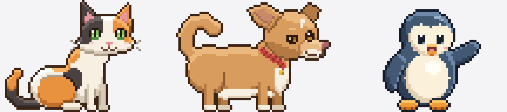

# Desktop Pets

A Windows reminder app with animated desktop companions. Create reminders through the pet's controls or the localhost API. Pet artwork and personality are separate from reminders and application behavior.



## Download

Get `DesktopPets.exe` from the [latest release](https://github.com/chrisjames432/desktop-pets/releases/latest). It is a single file for Windows 10 and 11 and needs no Python and no installer. Double-click it, pick a pet, and right-click the pet for reminders and Quit. Windows SmartScreen may warn about an unsigned app the first time; choose More info, then Run anyway.

## Meet the pets

| Pet | Who | Tricks |
| --- | --- | --- |
| Patches | Cheerful calico cat | Big stretch, wiggle and pounce, paw swat, wash face, purr, cozy nap, make biscuits, happy hop |
| Andrew | Chunky chihuahua with a lazy eye and a busy tail | Tippy taps, little bark, zoomies, happy hop, curl up for a nap |
| Pip | Round little penguin | Flipper wave, happy dance, belly slide, preen feathers, sleepy tuck, happy hop |

All three share one reminder list, one set of controls, and one API. Artwork is drawn in code on a 72 x 48 grid shown at 2x, using the shared kit in `desktop_pet/pets/pixelkit.py`.

## Run

Requires Windows and Python 3.10 or newer for source development.

```powershell
python -m pip install -r requirements.txt
python desktop_pets.py
```

Or double-click `start_pets.bat`. `start_cat.bat` and `start_penguin.bat` select a pet directly. Right-click a pet for reminder controls, choosing pets, walking/staying, tricks, and Quit.

Left-click opens the control bubble. Drag the pet to move it; release it to land on that monitor's usable bottom edge. Pets hop onto higher taskbar surfaces and drop after clearing them. Monitor work areas refresh every two seconds. Auto-hidden taskbars temporarily overlaying the work area are not separate obstacles.

## Persistent data

Reminders, preferences, backups, and rotating logs live in:

```text
%LOCALAPPDATA%\DesktopPets\
```

The first source launch copies legacy `reminders.json` and `settings.json` from this project if user data does not already exist. Originals are retained. Quit the old app before starting this version. After migration, use the UI or API; editing the old project JSON will not change the running app.

For isolated development, set `DESKTOP_PETS_DATA_DIR` to a temporary directory (and optionally `DESKTOP_PETS_API_PORT` to a spare port). That disables legacy migration. Packaged EXEs also skip legacy migration and never ship personal reminder data.

The reminder service keeps its data in memory and saves only when something changes. Atomic writes retain a previous backup. A damaged primary file can recover from that backup while retaining a copy of the damaged file; changes newer than the backup may be unavailable. If neither copy is valid, startup reports an error instead of silently replacing reminders with an empty list.

An unanswered alert is shown again after restarting. Dismiss removes it; snoozing changes its due time. Closing the alert window snoozes it for one hour. Simultaneous due reminders appear one at a time.

## Local API

The API binds only to `127.0.0.1:8766` while the app is running. The port is fixed for predictable integrations. A second instance is blocked. If another program or Windows account already holds the port, reminders still run, the API stays off for that session, the pet says so, and `app.log` records it; the app never moves to a different port. A source launch that still has legacy project data to migrate stops with an error instead, because the port may belong to the old app. Requests that carry a browser `Origin` header or a non-local `Host` are refused with 403 so web pages cannot create or dismiss reminders.

| Method | Path | Body |
| --- | --- | --- |
| GET | /reminders | Lists outstanding reminders |
| POST | /reminders | `{"text":"Review campaign","in_hours":2}` |
| POST | /reminders/1/dismiss | Empty object |
| DELETE | /reminders/1 | No body |
| GET | /pet/status | Current pet, actions, state, coordinates, and API port |
| POST | /pet/select | `{"pet":"penguin"}` |
| POST | /pet/action | `{"action":"silly"}` or an action returned by status |
| POST | /pet/roam | `{"roam":false}` |
| POST | /pet/speak | `{"text":"Hello!"}` |

Reminder creation accepts exactly one of `in_minutes`, `in_hours`, `in_days`, or `due`. Relative delays must be finite positive numbers. Exact timestamps accept ISO 8601: `2026-09-22T09:00:00-07:00` or UTC `2026-09-22T16:00:00Z`. Timestamps without an offset mean the current computer's local time. New reminders must fall between 1971 and 2999, the span Windows can display. Persisted dates are normalized to UTC; the interface displays local time.

```powershell
$body = @{ text = 'Review campaign'; in_hours = 2 } | ConvertTo-Json
Invoke-RestMethod http://127.0.0.1:8766/reminders -Method Post -ContentType 'application/json' -Body $body
```

UI commands are queued onto the Tk thread. Reminder operations use the same service as the manual interface. Legacy `/pet/state`, `/pet/meow`, and `/reminders/<id>/done` routes remain available; meow requests a species-appropriate random trick.

## Develop and add pets

- [Pet creation instructions](docs/PET_CREATION.md): the public contract, ownership rules for simultaneous agent work, and handoff checklist.
- [Resolution handoff and core reply](docs/ART_RESOLUTION_HANDOFF.md): the 72 x 48 art-grid upgrade.
- [Architecture](docs/ARCHITECTURE.md): module boundaries and maintenance workflow.

Pet modules export only `build_pet() -> PetDefinition` as their stable interface. Both the old 36 x 24 art grid and new 72 x 48 grid produce final 144 x 96 RGBA frames. Shared code does not depend on logical artwork resolution.

```powershell
python -m unittest discover -s tests -v
python tools/preview_pet.py penguin --output pip-preview.png
```

The preview tool requires no GUI, running app, or registry entry. It displays every frame in both directions on light/dark backgrounds, with ground guides. `--scale 2` enlarges with nearest-neighbor filtering.

## Build a single Windows EXE

Build on Windows in a development environment with the build dependencies:

```powershell
python -m pip install -r requirements-build.txt
.\build_exe.ps1
```

The script requires passing tests, then writes `dist\DesktopPets.exe`. The spec includes registered pets and optional files under `desktop_pet/pets/assets/`; it excludes user reminder/settings files. The source build does not need PyInstaller installed unless you are producing an executable.

Before sharing, test the EXE on a Windows account or machine without Python: chooser, manual/API reminder, snooze/dismiss, restart recovery, duplicate launch, monitor crossings, and retained data after replacing the EXE. Release EXEs are built with this script from a clean virtual environment and smoke tested with an isolated data folder before publishing.

## Historical references

`penguin_original.py`, the root sprite-sheet PNGs, and sprite-preview HTML files are historical references. The application never imports the old penguin implementation. Root `cat.py` and `penguin.py` are compatibility launchers; edit artwork under `desktop_pet/pets/`.
